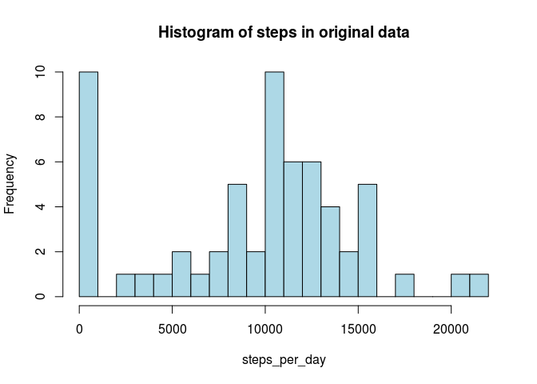
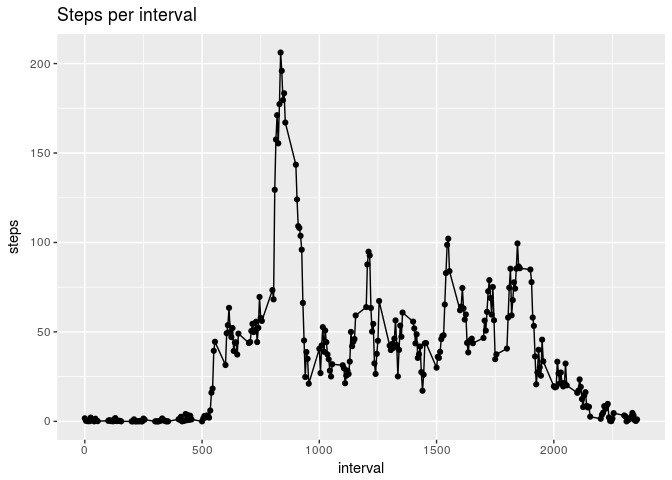
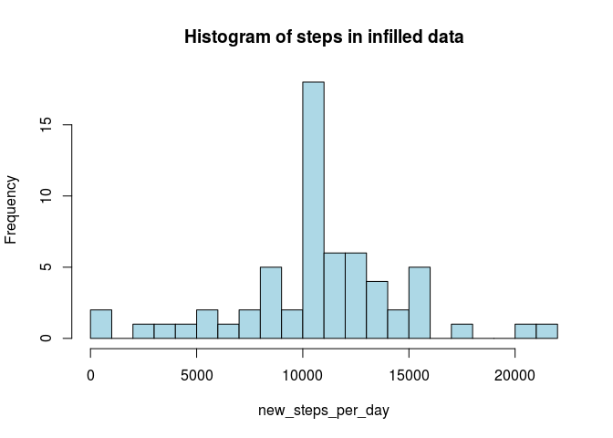
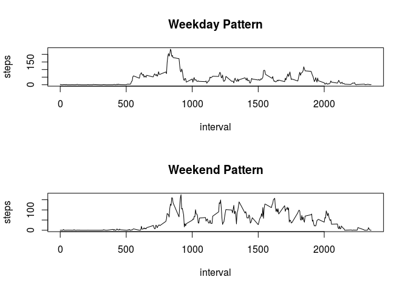

# Reproducible Research: Peer Assessment 1
R.M. Palmer  
March 18, 2017  


## Loading and preprocessing the data

```r
library(plyr)
library(ggplot2)
library(chron)

unzip(zipfile="activity.zip")
raw_data <- read.csv("activity.csv")
```

## What is mean total number of steps taken per day?

```r
steps_per_day <- with(raw_data,tapply(steps,date,sum,na.rm=TRUE))
hist(steps_per_day,breaks=25,col="light blue",main="Histogram of steps in original data")
```

<!-- -->

```r
mean_steps_per_day <- mean(steps_per_day)
median_steps_per_day <- median(steps_per_day)
```

The mean number of steps per day is 9354.2
The median number of steps per day is  10395

## What is the average daily activity pattern?

```r
interval_means <- with(raw_data,tapply(steps,interval,mean,na.rm=TRUE))
interval <- unique(raw_data$interval)
interval_plot <- qplot(interval,interval_means) + 
  xlab("interval") + 
  ylab("steps") + 
  geom_line() + 
  ggtitle("Steps per interval")
print(interval_plot)
```

<!-- -->

```r
peak_interval <- which.max(interval_means)
peak_time <- names(peak_interval)
peak_index <- peak_interval[[1]]
```

The interval with maximum number of steps, averaged across all days in the datasets, is 835, the 104-th interval

## Imputing missing values

```r
missing_count = sum(is.na(raw_data$steps))
my_lookup <- data.frame(interval,interval_means)
infilled <- merge(raw_data,my_lookup)
infilled <- mutate(infilled,steps=ifelse(is.na(steps),interval_means,steps))
```

There are 2304 missing values.

After replacing missing values with the mean over days by interval, a histogram looks like the following:


```r
new_steps_per_day <- with(infilled,tapply(steps,date,sum,na.rm=TRUE))
hist(new_steps_per_day,breaks=25,col="light blue",main="Histogram of steps in infilled data")
```

<!-- -->

```r
new_mean_steps_per_day <- mean(new_steps_per_day)
new_median_steps_per_day <- median(new_steps_per_day)
```

After replacing missing values,  

The new mean number of steps per day is 10766.2
The new median number of steps per day is 10766.2 

Both the mean and median were raised after imputing missing data in this way.

## Are there differences in activity patterns between weekdays and weekends?

```r
labeled <- mutate(raw_data,w =as.factor(ifelse(is.weekend(date),"weekend","weekday")))
breakdown <- with(labeled,tapply(steps,list("w"=w,"interval"=interval),mean,na.rm=TRUE))
par(mfrow=c(2,1))
plot(interval,breakdown[1,],type="l",xlab="interval",ylab="steps",main="Weekday Pattern")
plot(interval,breakdown[2,],type="l",xlab="interval",ylab="steps",main="Weekend Pattern")
```

<!-- -->

On weekdays, there is a higher level of activity in the mornings.  On weekends, the overall activity level is higher and more varried.
